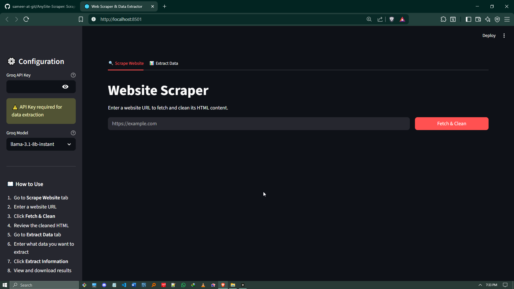
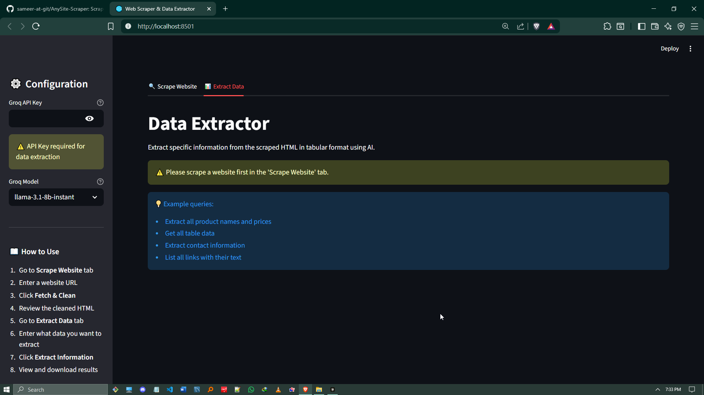
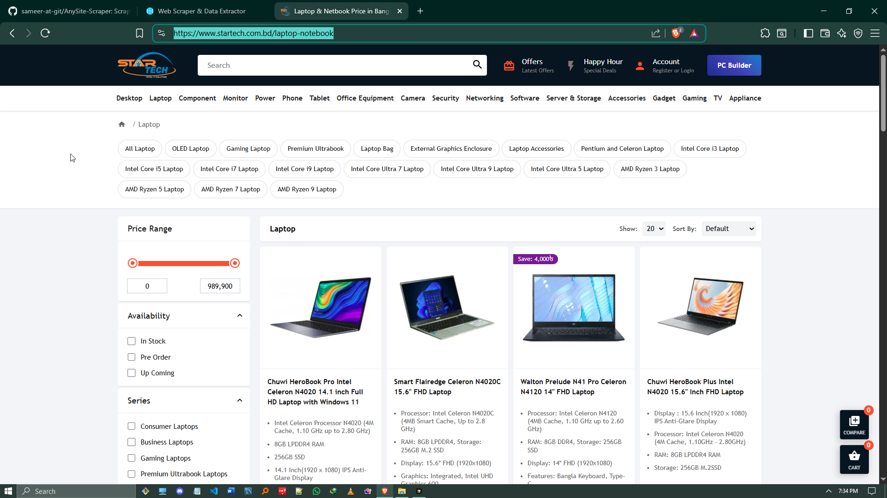
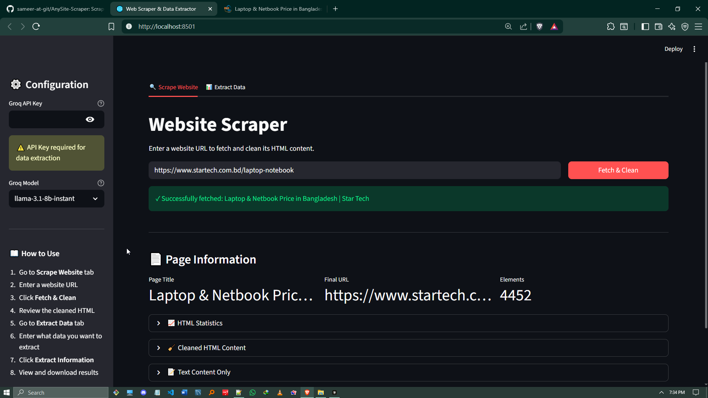
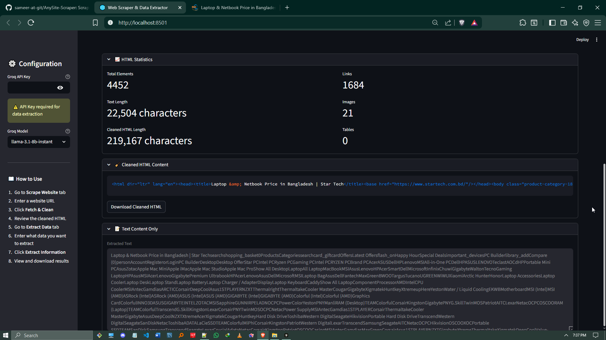
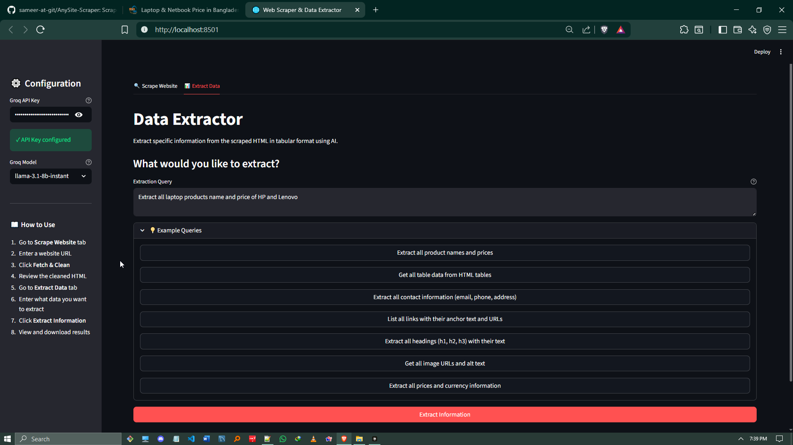
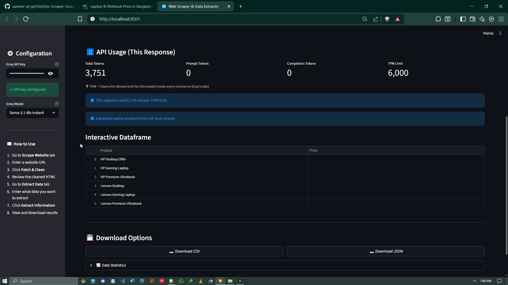

# Web Scraper & Data Extractor

A Streamlit application that allows users to scrape websites, clean HTML content, and extract structured data using AI-powered extraction with LangChain and Groq.

## Overview

Here's a visual walkthrough of the application:

1. **Scrape Page**
   

2. **Data Extractor Page**
   

3. **Target Page**
   

4. **Finished Scrape Page**
   

5. **Details Scrape Page**
   

6. **Extracting Page**
   

7. **Finished Extracting Page**
   

## Features

- **Website Scraping**: Fetch full HTML content from any website using Selenium
- **HTML Cleaning**: Remove scripts, styles, and unnecessary elements while preserving structure
- **AI-Powered Extraction**: Extract tabular data from HTML using Groq LLM
- **Interactive Display**: View extracted data as HTML tables and interactive dataframes
- **Export Options**: Download extracted data as CSV or JSON

## Prerequisites

- Python 3.8 or higher
- Chrome browser installed (for Selenium)
- Groq API key ([Get one here](https://console.groq.com/))

## Installation

1. Clone or download this repository

2. Install dependencies:
```bash
pip install -r requirements.txt
```

3. (Optional) Create a `.env` file for your Groq API key:
```env
GROQ_API_KEY=your_groq_api_key_here
```

## Usage

1. Run the Streamlit application:
```bash
streamlit run app.py
```

2. Open your browser to the URL shown (usually `http://localhost:8501`)

3. **Configure API Key**:
   - Enter your Groq API key in the sidebar
   - Select a Groq model (default: llama-3.1-8b-instant - recommended for free tier)

4. **Scrape Website**:
   - Go to the "Scrape Website" tab
   - Enter a website URL
   - Click "Fetch & Clean"
   - View cleaned HTML and statistics

5. **Extract Data**:
   - Go to the "Extract Data" tab
   - Enter a query describing what data you want to extract
   - Click "Extract Information"
   - View results and download as CSV or JSON

## Example Queries

- "Extract all product names and prices"
- "Get all table data from HTML tables"
- "Extract all contact information (email, phone, address)"
- "List all links with their anchor text and URLs"
- "Extract all headings (h1, h2, h3) with their text"

## Project Structure

```
tota/
├── app.py              # Main Streamlit application
├── scraper.py          # Selenium web scraping module
├── cleaner.py          # HTML cleaning utilities
├── extractor.py        # LangChain extraction chain
├── requirements.txt    # Python dependencies
└── README.md          # This file
```

## Technologies Used

- **Streamlit**: Web UI framework
- **Selenium**: Web scraping with JavaScript rendering
- **BeautifulSoup4**: HTML parsing and cleaning
- **LangChain**: LLM orchestration framework
- **LangChain Groq**: Groq integration for LangChain
- **Pandas**: Data manipulation and export
- **WebDriver Manager**: Automatic ChromeDriver management

## Notes

- The application uses headless Chrome for scraping
- HTML content is truncated if too long to fit within LLM token limits
- Some websites may block automated scraping - use responsibly
- Make sure Chrome browser is installed for Selenium to work

## Troubleshooting

**Chrome/ChromeDriver issues:**
- Ensure Chrome browser is installed
- WebDriver Manager will automatically download the correct ChromeDriver

**API Key errors:**
- Verify your Groq API key is correct
- Check your API quota/limits

**Timeout errors:**
- Some websites may take longer to load
- Try again or check if the website is accessible

## License

This project is provided as-is for educational and personal use.

